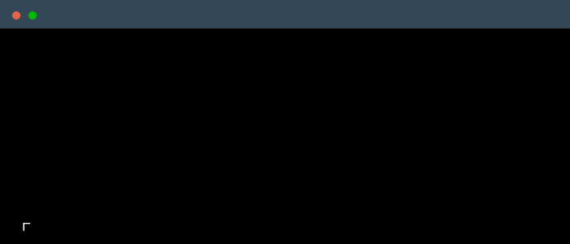

 

    

### Main skills

### Studying

### Employer?
> [!IMPORTANT]  
> <a href="https://louaialsabbagh.tech/LouaiEnglishCv.pdf" download>Download my resume</a>

<!--
     Thanks for being my guest <3
-->
